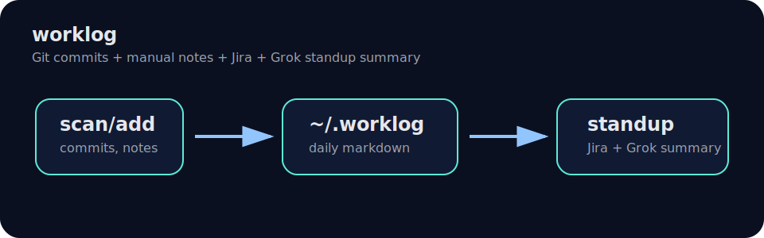

# worklog

[English](README.md) | [Русский](README.ru.md)

<p align="center">
  
</p>



Local work diary without Git hooks and without changing existing repositories.

`worklog` scans Git repositories, writes commits and manual notes to daily Markdown files, groups entries by task key like `ABC-123`, and can prepare a standup summary with Groq.

## Install

```bash
git clone git@github.com:PiomClone/workglog.git
cd workglog
make install
```

The binary is linked to:

```text
~/.local/bin/worklog
```

## Usage

```bash
worklog                          # interactive wizard
worklog scan
worklog add "ABC-123 what I did"
worklog add --task ABC-123 "manual note without task key"
worklog add --last "manual note for the only task of the day"
worklog add --plan "ABC-123 next step"
worklog add --blocker "ABC-123 waiting for access"
worklog report
worklog report 2026-06-22
worklog standup                  # previous workday, scan + Groq summary
worklog standup --prompt         # previous workday prompt only
worklog summarize --prompt
worklog summarize --ai --model llama-3.3-70b-versatile
worklog stats                    # task/Groq statistics
worklog version
```

## Common flows

### Daily Telegram report without AI

```bash
worklog scan
worklog report
```

`report` does not call Groq. It reads the daily Markdown file, removes time/repo/sha noise, deduplicates identical commit messages, and formats text for Telegram.

### Add manual entries

```bash
worklog add "ABC-123 what I did"
worklog add --task ABC-123 "manual note without task key"
worklog add --last "manual note for the only task of the day"
worklog add --plan "ABC-123 next step"
worklog add --blocker "ABC-123 waiting for access"
```

In Web report, choose a task from the dropdown: the task key is prepended automatically. If a manual entry is wrong, edit the day file directly:

```bash
$EDITOR ~/.worklog/days/2026-06-23.md
worklog report 2026-06-23
```

### Rescan commits for a day without touching manual entries

```bash
worklog scan --since "2026-06-23 00:00" --force
worklog report 2026-06-23
```

`--force` ignores `state.json`, but SHA deduplication still prevents duplicate commits. Manual sections `Manual`, `Plan`, and `Blockers` are preserved.

### Regenerate Groq summary after manual edits

```bash
worklog standup --date 2026-06-23 --no-scan
cat ~/.worklog/summaries/2026-06-23.md
```

`summary` is the saved Groq result. `report` is a local Telegram-ready report without AI.

### Web UI in background

```bash
worklog web start
worklog web status
worklog web stop
worklog web restart
```

Foreground mode is still available:

```bash
worklog web
```

## Storage

```text
~/.worklog/
  config.json
  state.json
  days/YYYY-MM-DD.md
  summaries/YYYY-MM-DD.md
```

Example config:

```json
{
  "scan_root": "/Users/avkorkin/prj",
  "groq_model": "llama-3.3-70b-versatile",
  "groq_base_url": "https://api.groq.com/openai/v1",
  "jira_url": "https://jira.example.com",
  "jira_user": "user@example.com"
}
```

## Commands

### Interactive wizard

```bash
worklog
```

The wizard lets you choose scan, add note, report, standup summary, standup prompt, or setup. Explicit commands bypass the wizard.

### Scan commits

```bash
worklog scan
```

Defaults:

- root: `/Users/avkorkin/prj`
- range: start of today (`YYYY-MM-DD 00:00`)
- refs: all local refs/branches by default; use `--current-branch` for current HEAD only
- author: global `git config user.email`, fallback to `user.name`

Options:

```bash
worklog scan --root /path/to/projects
worklog scan --since "14 days ago"   # bootstrap
worklog scan --since "30 days ago"
worklog scan --all-authors
worklog scan --author user@example.com
worklog scan --force             # ignore state.json, deduplicate by SHA in day files
```

### Add manual entry

```bash
worklog add "ABC-123 call about integration"
worklog add --date 2026-06-22 "ABC-123 retro note"
worklog add --type plan "ABC-123 next step"
worklog add --type blocker "ABC-123 waiting for access"
worklog add --plan "ABC-123 next step"
worklog add --blocker "ABC-123 waiting for access"
```

### Report

```bash
worklog report
worklog report 2026-06-22
```

Entries are grouped by:

```text
\b[A-Z][A-Z0-9]+-\d+\b
```

Entries without a task key go to `untracked`.

### Standup summary

Prompt only:

```bash
worklog summarize --prompt
worklog standup --prompt --no-scan
```

Generate with Groq:

```bash
security add-generic-password -a "$USER" -s groq-api-token -w "YOUR_GROQ_API_KEY" -U
worklog summarize --ai
```

If Groq key is missing, `worklog` falls back to a simple local summary.

Prompt template override:

```bash
worklog prompt init
worklog prompt path
worklog prompt print
```

Template file:

```text
~/.worklog/prompts/standup.md
```

Placeholders: `{{date}}`, `{{done}}`, `{{planned}}`, `{{blockers}}`.

The summary is saved to:

```text
~/.worklog/summaries/YYYY-MM-DD.md
```

## Web UI

Run local web interface:

```bash
worklog web                         # foreground
worklog web --addr 127.0.0.1:8088
worklog web start                   # background via launchctl
worklog web stop
worklog web status
worklog web restart
```

By default it listens on localhost only. If you bind to a public address, pass a token:

```bash
worklog web --addr 0.0.0.0:8088 --token "secret"
worklog web start --addr 0.0.0.0:8088 --token "secret"
```

Current Web UI supports the same storage as CLI:

- dashboard with task and Groq limit statistics;
- report by date with copy button for Telegram text;
- prompt preview;
- saved Groq summary view with copy button;
- scan action, including force rescan;
- add manual note: done / plan / blocker;
- generate standup;
- buttons disabled while requests are running;
- clean setup/config page.

## Development

```bash
make fmt
make test
make build
make install
```

## Versioning

Version is stored in `VERSION`.

Create a release:

```bash
git tag v$(cat VERSION)
git push origin main --tags
```

Pushing a `v*.*.*` tag runs the release workflow and publishes binaries.

## License

MIT
